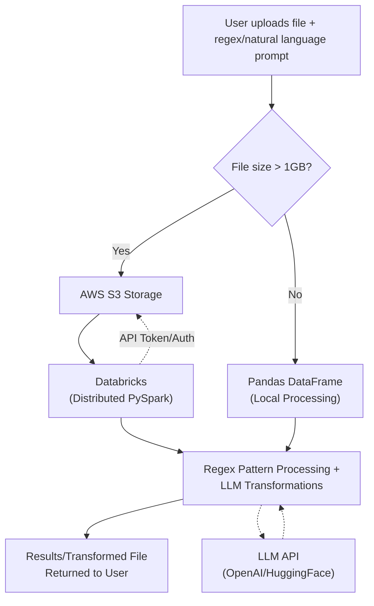

# Rhombus Regex App

This application that I have created is used to look for patterns in the file submitted by the user and takes in a natural language input from the user. This is then used to replace the pattern with the suggested replacement. I have added a lot more features to this app- to handle many data operations, a system design that could handle large files even >100gbs and also a risk assessment to warn the user what could happen with such a change.
## Demo Video

Below is a short demo video showing the app in action:


## Overview and my Initial System design


- **Smart File Loader:**  
  - If the file size is **greater than 1GB**, this app would use my  **local PySpark**-This will be used to accomplish and handle those huge files using distrubuted processing or **Databricks on AWS S3**(Which I havn't called because it would incur cost to run my databricks cluster) for distributed processing.
  - If the file size is **1GB or less**, it loads the data using **pandas** for simplicity and speed.
- **Risk Analysis:**  
  Every execution path includes analysis of potential risks, such as memory errors, network issues, and permission problems.
- **LLM-powered Data Transformations:**  
  This uses **OpenAI's GPT-4** model to perform data transformations. It can achieve many different types of data processing tasks-
  use cases:
  1) Replace dd/mm/yyyy with yyyy-mm-dd.
  2) Change all dates to YYYY-MM-DD format.
  3) Replace a string with another string or even a substring
  4) Also, it could work with numbers as well. Like:" Double everyone's age"- so, this will double everyone's age in the age column.

---

## Instructions for Setup and Running

### Prerequisites

- Python 3.8+
- [pip](https://pip.pypa.io/en/stable/)

- [Docker](https://www.docker.com/) (**optional**)
- For PySpark:(**optional**-This is only needed if the file size is greater than 1GB)
- Java 8/11


### Installation

#### Option 1: Using Docker


### 1. Prerequisites
- [Docker](https://www.docker.com/get-started)
- [Docker Compose](https://docs.docker.com/compose/)

### 2. Clone the repository
```bash
git clone https://github.com/1rn19cs176varunalingam/rhombus-regex-app.git
cd rhombus-regex-app
```

### 3. The OpenAI API key:
This is already set within my docker image so, you would not be required to create one manually.

### 4. Build and run the containers
This will make use of two images and a docker-compose file.
```bash
docker-compose up
```

### 5. Access the app:
You can just access the frontend to run the app using the following url:
- **Frontend:** http://localhost:3000
- **Backend API:** http://localhost:8000


#### Option 2: Using Local Setup:

```bash
# Clone the repository
git clone https://github.com/1rn19cs176varunalingam/rhombus-regex-app.git
cd rhombus-regex-app

# Install dependencies
pip install -r requirements.txt
```


- This will install all the required packages and dependencies for the application.


#### Option 2: Local Setup

1. **Backend (Django API)**
   - Open a terminal and navigate to the project root in my case it is rhombus-regex-app:
     ```bash
     cd rhombus-regex-app
     ```
   - You can create a seperate virtual environment if needed:
     ```bash
     python3 -m venv venv
     source venv/bin/activate
     ```
   - Install all the python dependencies, which i have in my requirements.txt file:
     ```bash
     pip install -r requirements.txt
     ```
   - You will need to set up an open api key: but on docker image i have already set that in the image
     ```bash
     export OPENAI_API_KEY=your-openai-key-here
     ```
   - Run Django migrations:
     ```bash
     python manage.py migrate
     ```
   - Start the Django server:
     ```bash
     python manage.py runserver 
     ```

2. **Frontend (React App)**
   - Open a new terminal and navigate to the frontend directory:
     ```bash
     cd rhombus-regex-app/frontend
     ```
   - Install Node.js dependencies:
     ```bash
     npm install
     ```
   - Start the React development server:
     ```bash
     npm run dev
     ```

3. **Access the app**
   - Open your browser and go to: [http://localhost:3000](http://localhost:3000)
   - The backend API will be available at: [http://localhost:8000](http://localhost:8000)

*Make sure both the backend and frontend servers are running for the app to work fully!*


---

## Risk Analysis

The Risk analysis is an another feature I have provided within my app. This is just for the user to understand the potential risks associated with the regex pattern and replacement. 


---

## Additional Notes

- For **Databricks and S3 integration**,

